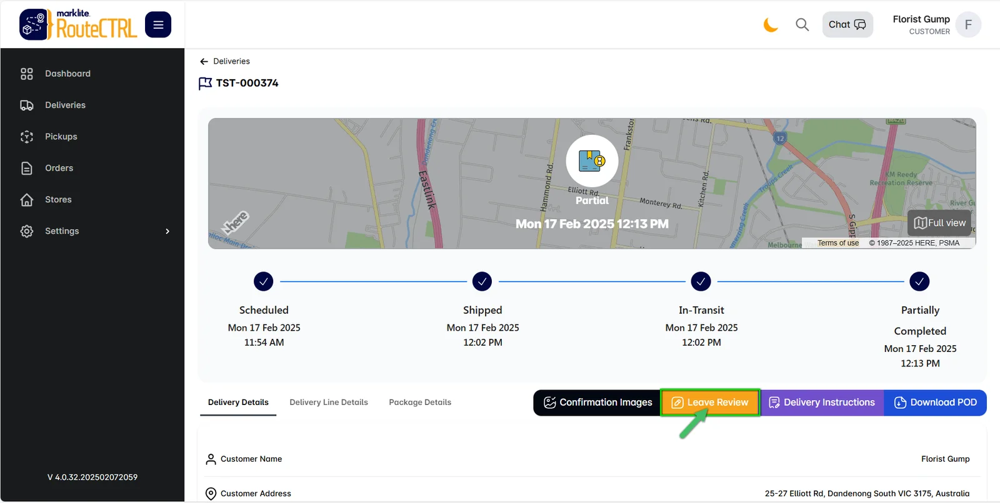
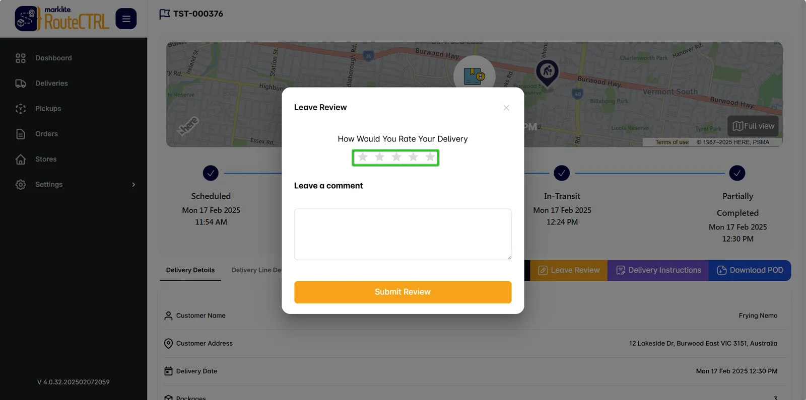
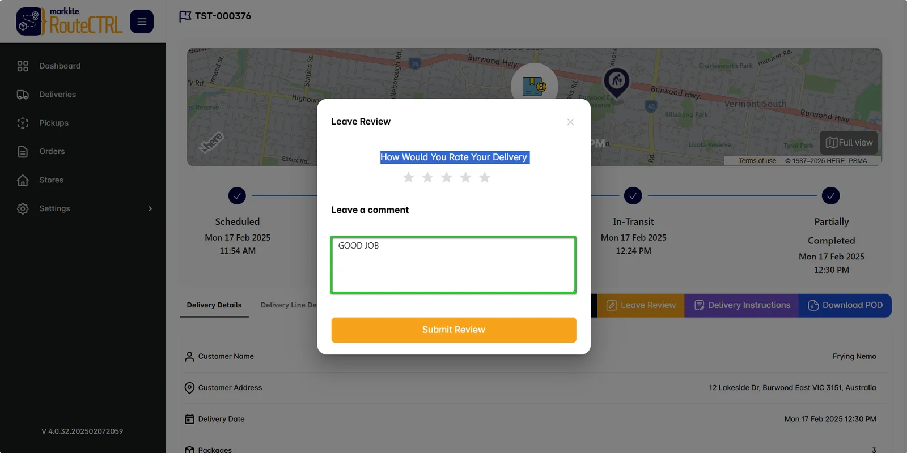
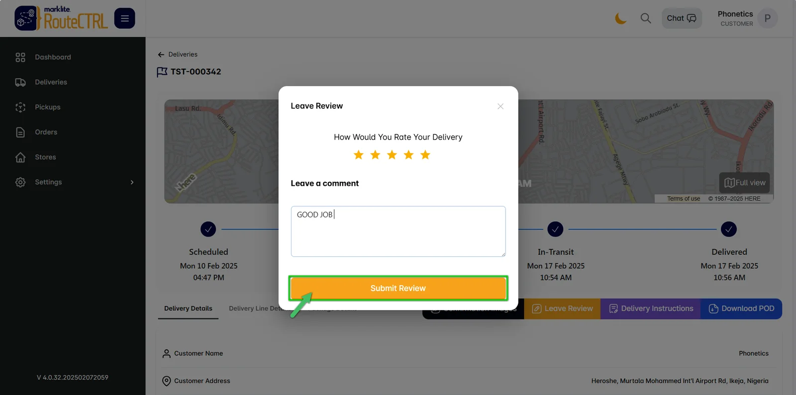
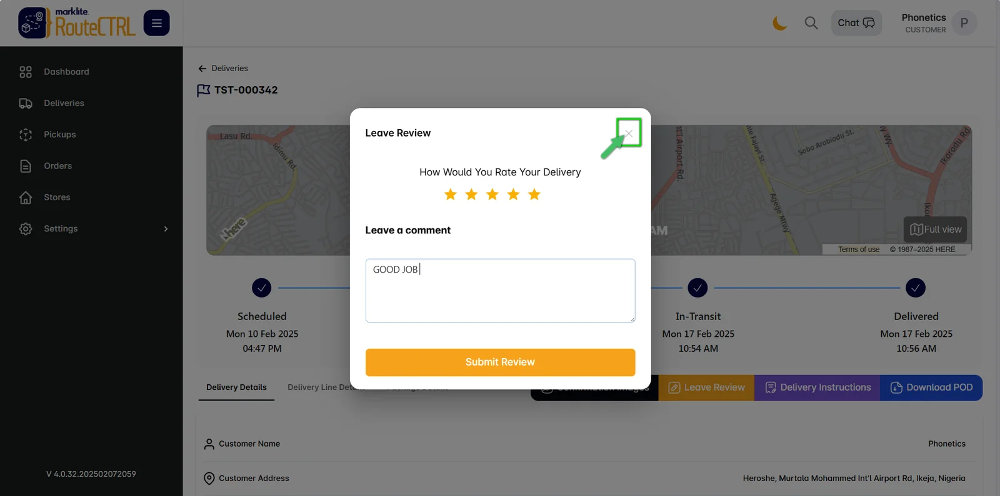

# How to Leave a Review

In this tutorial, we'll guide you through the process of leaving a review for your shipment.

## Step 1: Click on Leave Review

To start, go to the delivery page and click on the **Leave Review** button.

## Step 2: Rate Your Shipment Out of 5 Stars

Rate your shipment on a scale of 1 to 5 stars based on your experience.

## Step 3: Leave a Comment

Add any additional comments or feedback about your shipment in the provided text box.

## Step 4: Click on Submit Review

Once you're done, click the **Submit Review** button to submit your feedback.

## Step 5: Click on the Exit Button

After submitting the review, click on the **Exit** button to leave the page.

