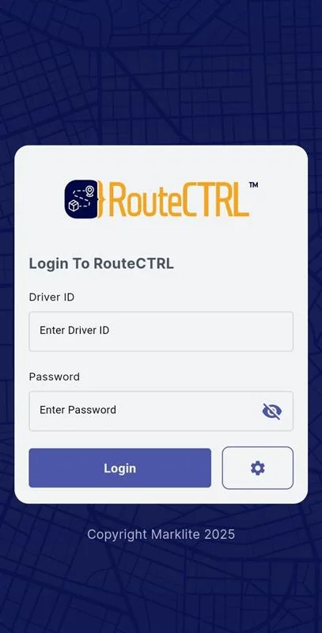
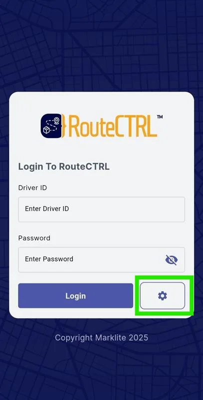
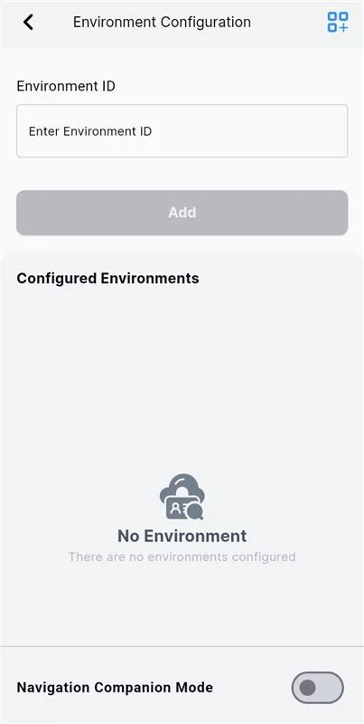
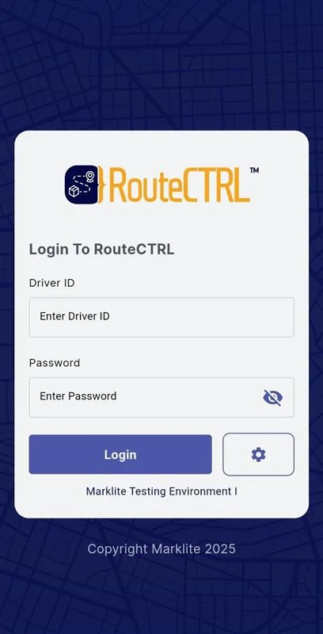
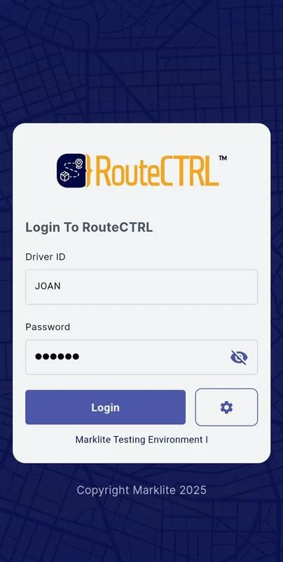

# How to Login to the Driver App

Follow the steps below to log into the RouteCTRL Driver App:

---

### Step 1: Open the Driver App

Launch the app from your mobile device.

---

### Step 2: Tap the **Settings** icon to configure your RouteCTRL environment

This lets you specify which environment (test/live) the app should connect to.

---

### Step 3: Enter your **Environment ID** and tap the **Add** button

This configures the app to point to the correct RouteCTRL environment.

---

### Step 4: Tap the **Back** button to return to the Login page

Once your environment is configured, head back to the login screen.

---

### Step 5: Enter your **Driver ID** and **Password**, then tap the **Login** button

You’re now ready to access your RouteCTRL Driver App dashboard.

