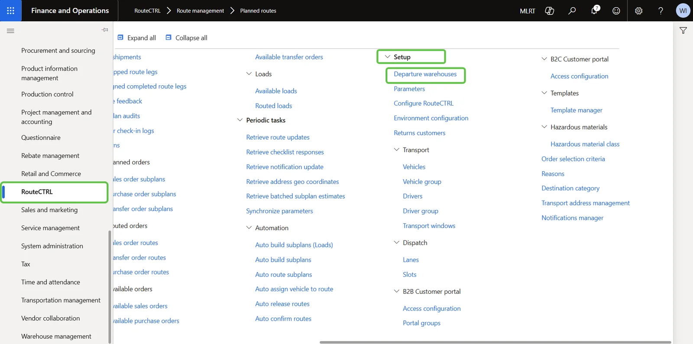
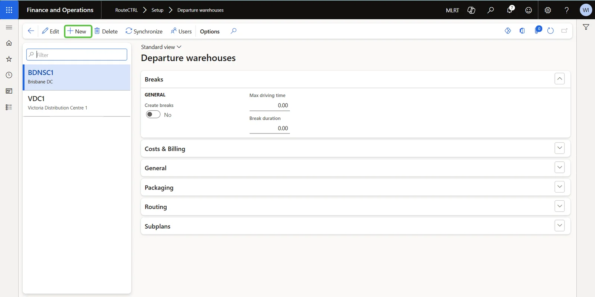
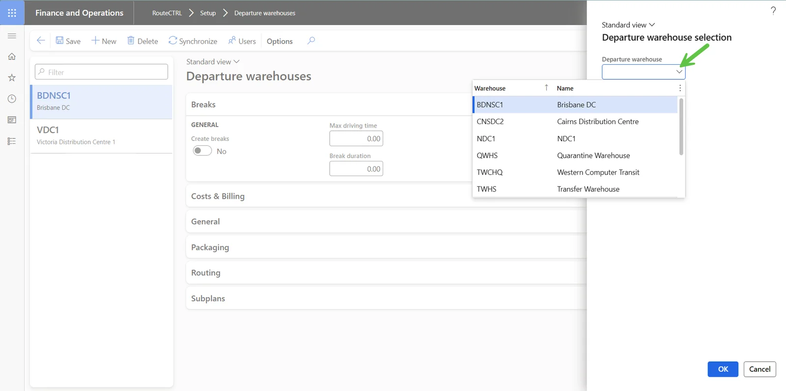
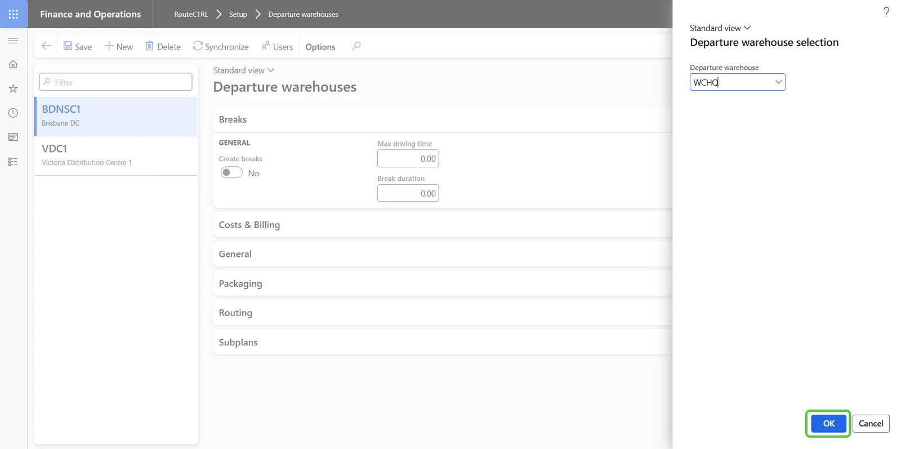
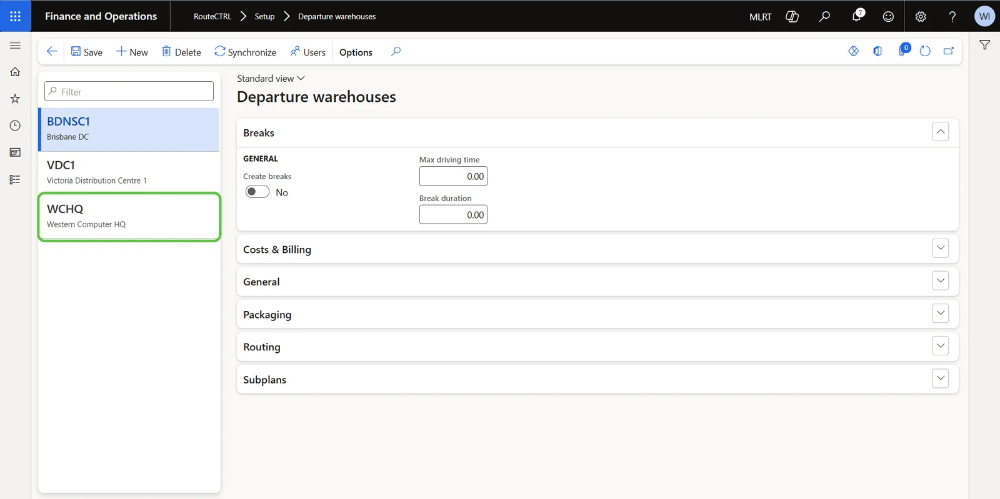
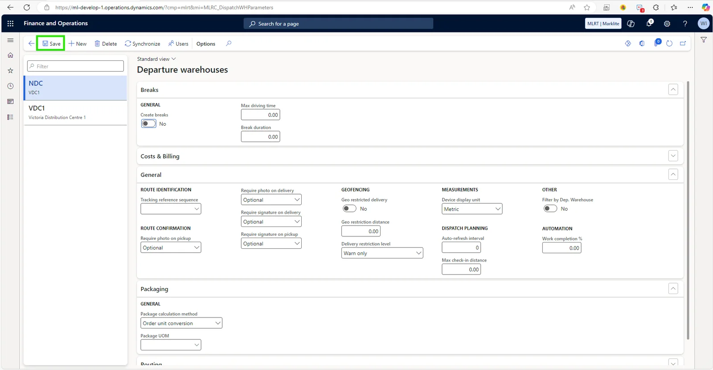

# How to Configure Departure Warehouses

Follow these steps to set up your Departure Warehouses in RouteCTRL for Dynamics 365 BC:

---

### Step 1  
Go to **Modules > RouteCTRL > Setup**, then click on the **Departure Warehouses** button.

---

### Step 2  
Click on the **New** button.

---

### Step 3  
Select a departure warehouse from the **Departure Warehouse** dropdown menu.

---

### Step 4  
Click on the **OK** button.

---

### Step 5  
Select the warehouse you just created.

---

### Step 6  
Adjust the settings as needed, then click **Save**.

---